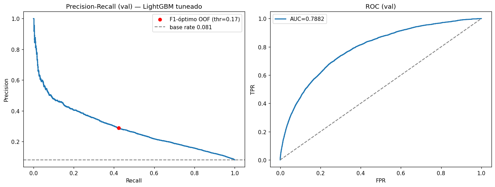
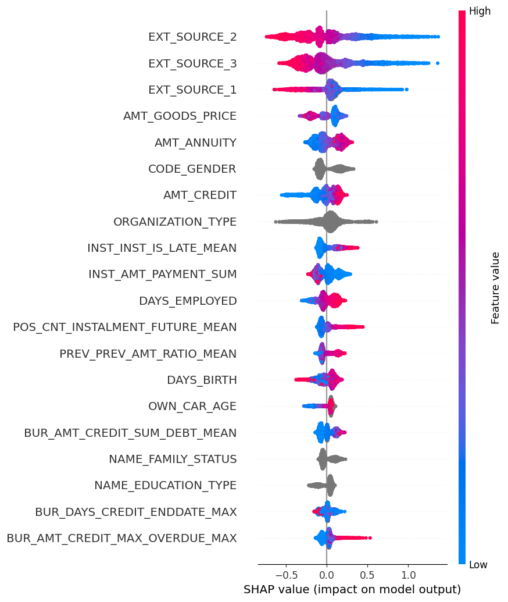

# Home Credit Default Risk — Predicción de impago con datos alternativos

[](https://github.com/oswaldoaqm/ML-Proyecto-CreditRisk/actions/workflows/ci.yml)


> **En una línea:** un pipeline completo de credit scoring sobre 58 millones de registros en 7 tablas relacionales, que termina en un LightGBM validado externamente en Kaggle — y en una auditoría de equidad algorítmica que casi nadie hace.

Proyecto final del curso **Machine Learning (CS 3061)** — UTEC, Lima.
Autores: **Oswaldo Alejandro Quispe Monzón** · Maricielo Patricia Valverde Quispe.

---

## Resultados en 30 segundos

| Métrica | Valor |
|---|---|
| AUC validación interna (held-out intacto, 20%) | **0.7882** — IC bootstrap 95%: [0.781, 0.794] |
| AUC Kaggle público / privado (late submission) | **0.78309 / 0.77958** |
| Ganador de la competencia (referencia) | 0.80570 (ensambles masivos de decenas de modelos) |
| Distancia validación interna ↔ test externo | 9 milésimas: **protocolo sin fugas** |
| Punto de operación (umbral OOF 0.172) | precisión 0.288 (lift 3.6×), recall 0.424 |
| Hardware | Una laptop de 16 GB de RAM. Nada más. |

---

## El problema

El acceso al crédito es un motor de desarrollo, pero la banca tradicional rechaza a quien no tiene historial crediticio. Home Credit presta a esa población *unbanked* usando datos alternativos, y publicó en Kaggle su problema real: **predecir qué solicitantes van a impagar** a partir de 7 tablas relacionales — la solicitud, el buró de crédito, su historial mensual, solicitudes previas y tres tablas de comportamiento de pago.

Lo que hace difícil el problema no es el tamaño, es la forma: la unidad de predicción es una solicitud (307,511 filas con target), pero la señal vive en tablas de granularidad crédito-mes con hasta 27 millones de filas, coberturas que van del 94.8% al 28.3%, valores centinela disfrazados de datos (`365243` en columnas de días, `XNA` en categóricas), y solo 8.07% de positivos.

## Los datos

| Tabla | Filas | Qué contiene |
|---|---|---|
| application_train / test | 307,511 / 48,744 | La solicitud: demografía, montos, scores externos |
| bureau | 1,716,428 | Créditos previos reportados al buró |
| bureau_balance | 27,299,925 | Historial mensual de cada crédito del buró |
| previous_application | 1,670,214 | Solicitudes anteriores en Home Credit |
| POS_CASH_balance | 10,001,358 | Historial mensual de créditos POS |
| credit_card_balance | 3,840,312 | Historial mensual de tarjetas |
| installments_payments | 13,605,401 | Cada cuota: cuánto y cuándo se pagó |

## Cómo lo resolví

El proyecto avanza en 8 fases documentadas notebook por notebook (la bitácora completa de decisiones está en [`PROJECT_STATE.md`](PROJECT_STATE.md)):

**1. Auditoría (01):** los 8 CSV pasan a parquet con downcasting de tipos: −50% de memoria. Es lo que permite que 27M de filas quepan en una laptop.

**2–3. Limpieza y EDA de application (02a–02c):** aquí apareció el primer hallazgo que cambió el proyecto. El valor `365243` en `DAYS_EMPLOYED` afectaba 55,374 filas (18%); mi primera lectura fue ruido de captura. Al cruzarlo con ocupación resultó lo contrario: son pensionistas, e impagan *menos* (5.40% vs 8.66%). La anomalía no era un error: era información, y quedó como indicador binario. También descarté la información mutua como criterio de selección — con imputación centinela, lo informativo es la *nulidad*, no el valor — y me quedé con AUC univariado corregido por dirección.

**4–6. EDA + agregación de las 6 tablas de historial (03a–05c):** cada tabla se colapsa a nivel cliente con estadísticas de agregación + features de dominio: utilización de tarjeta, días de atraso por cuota, razón aprobado/solicitado. El patrón que se repitió en todas: **la recencia y longitud del historial predicen más que los montos y la mora puntual** (los eventos DPD son tan raros que el promedio los diluye).

**7. Merge maestro (06):** left joins 1:1 validados con asserts, flags `HAS_*` creadas *antes* del join porque la ausencia de historial no es un hueco que imputar: es información (*thin file*). Resultado: 307,511 × 253.

**8. Modelado (07 + scripts/08):** regla autoimpuesta desde el inicio — un held-out del 20% que no se toca hasta el final. Hiperparámetros por CV 5-fold estratificada (Optuna, 114 trials), umbral por predicciones out-of-fold, target encoding cross-fitted. Ocho configuraciones comparadas bajo el mismo protocolo.

## Lo que no esperaba encontrar

Estos cuatro resultados me contradijeron, y son la parte que más me gusta del proyecto:

1. **Re-ponderar la clase minoritaria destruye el boosting.** La receta estándar contra el desbalance (`scale_pos_weight=11.4`) colapsó el entrenamiento: parada temprana en 1–3 iteraciones, −65 milésimas de AUC. El AUC ordena, no clasifica: el desbalance se maneja en el umbral de decisión, no en el entrenamiento.
2. **El upselling es un anti-patrón de riesgo.** Los clientes a quienes se aprobó *más* de lo que pidieron impagan más (`PREV_AMT_RATIO_MEAN`, AUC univariado 0.573, confirmado por SHAP).
3. **El MLP perdió hasta contra la regresión logística** (0.7701 vs 0.7749), pese a tener muchos más parámetros. Es la conclusión de Gunnarsson et al. (EJOR 2021) replicada con mis datos: en tabular de crédito, deep learning no le gana al boosting.
4. **Quitar el género del modelo no quita el género de los datos.** Eliminar `CODE_GENDER` cuesta 0.0018 de AUC, pero los proxies reconstruyen ~68% del gap entre géneros. *Fairness through unawareness* es necesario pero insuficiente.

## Resultados

| Modelo | AUC train | AUC val | Gap |
|---|---|---|---|
| Regresión logística (L2) | 0.7763 | 0.7749 | +0.0014 |
| Árbol de decisión (prof. 5) | 0.7166 | 0.7131 | +0.0035 |
| Árbol sin podar | 0.9943 | 0.5387 | +0.4556 |
| Random Forest | 0.9836 | 0.7675 | +0.2161 |
| MLP (64–32) | 0.8024 | 0.7701 | +0.0323 |
| XGBoost (sin ajustar) | 0.8655 | 0.7858 | +0.0798 |
| LightGBM (sin ajustar) | 0.8840 | 0.7849 | +0.0991 |
| **LightGBM + Optuna** | 0.8514 | **0.7882** | +0.0632 |

La tabla es también una clase de bias–variance: el árbol sin podar memoriza (gap +0.456), el bagging mata la varianza, el boosting mata el sesgo. Y la logística a 13 milésimas del ganador dice algo real: gran parte de la señal es lineal y monótona, dominada por los scores externos `EXT_SOURCE_*`.



**El umbral es política, no técnica.** Con 8% de positivos, las probabilidades se centran lejos de 0.5. El umbral F1-óptimo (0.172, elegido en OOF de train, nunca en validación) marca el 11.8% de solicitudes con lift de 3.6× sobre la tasa base. ¿Prefieres capturar el 70% de los impagos? Precisión 0.188. Ese trade-off es una decisión de negocio y el modelo la expone en lugar de esconderla.

## Interpretabilidad



SHAP confirma la jerarquía del EDA: los tres scores externos dominan, seguidos de los montos del crédito y de las features de comportamiento construidas en la agregación (proporción de cuotas tardías, utilización de tarjeta). Y expone un problema: `CODE_GENDER` es la feature #6 de 251 — el modelo se apoya en un atributo protegido. Eso motiva la sección siguiente.

## Equidad algorítmica

El modelo está **calibrado por grupo** (probabilidad media predicha ≈ tasa real, en género y edad) y su AUC es casi idéntico entre géneros (F 0.7830 / M 0.7854). Y sin embargo, a umbral fijo, las tasas de error divergen: TPR 0.370 (F) vs 0.496 (M); FPR 0.072 vs 0.131. No es un bug: es el **teorema de imposibilidad** (Kleinberg et al., 2017) — con tasas base distintas (7.0% vs 10.1%), calibración e igualdad de errores no pueden coexistir.

Evalué dos mitigaciones: umbrales por grupo para igualar oportunidad (TPR ~0.45 en ambos → cuesta precisión global: 0.288 → 0.270) y *unawareness* (ver hallazgo 4 arriba). La conclusión honesta: la equidad exige elegir explícitamente qué criterio igualar y asumir su costo. Es de las pocas partes del proyecto donde la respuesta correcta no es un número.

## Reproducibilidad

```bash
git clone https://github.com/oswaldoaqm/ML-Proyecto-CreditRisk.git
cd ML-Proyecto-CreditRisk
pip install -r requirements.txt

# 1. Descargar los CSV de Kaggle en data/raw/
#    https://www.kaggle.com/c/home-credit-default-risk/data
# 2. Ejecutar notebooks en orden: 01 → 07
#    Cada fase lee/escribe parquet en data/processed/ y libera memoria al cerrar.
# 3. Baselines adicionales:
python scripts/08_extra_baselines.py
```

Todo corre en 16 GB de RAM: el pipeline fue diseñado para eso (downcasting, parquet por fases, `gc.collect()` entre tablas). Semillas fijadas en todos los splits y modelos (`random_state=42`).

## Estructura

```
├── notebooks/            # 12 notebooks: auditoría → EDA → agregación → modelado
│   ├── models/           # Booster LightGBM final (lgbm_tuned.txt)
│   └── reports/          # Figuras, rankings AUC por tabla, submission
├── scripts/              # Baselines XGBoost + MLP reproducibles
├── paper/                # Informe final IEEE Transactions (LaTeX)
├── PROJECT_STATE.md      # Bitácora completa: cada decisión con su porqué
├── requirements.txt
└── data/                 # No versionada (ver .gitignore)
```

## Stack

`pandas` · `pyarrow` · `scikit-learn` · `LightGBM` · `XGBoost` · `Optuna` · `SHAP` · `matplotlib/seaborn` — Python 3.11.

## Limitaciones (las digo yo antes de que las digas tú)

- La muestra de Kaggle no trae fechas absolutas: no pude hacer validación temporal (aunque el score externo de Kaggle mitiga la duda de generalización).
- XGBoost y el MLP compiten sin tuning exhaustivo; la comparación justa contra LightGBM es en su versión sin ajustar (0.7858 vs 0.7849: empate técnico).
- El umbral F1-óptimo es un placeholder razonable: con costos monetarios reales de FN/FP, se optimizaría por utilidad esperada.
- Fairness auditada en género binario y edad; queda pendiente el análisis interseccional.

## Paper

El informe completo en formato IEEE Transactions está en [`paper/main.tex`](paper/main.tex): metodología, resultados, análisis de equidad y 15 referencias.

---

*Proyecto desarrollado para CS 3061 — Machine Learning, UTEC (Prof. Victor Eduardo Martínez Abaunza). El dataset pertenece a Home Credit Group vía Kaggle y se usa con fines académicos.*
